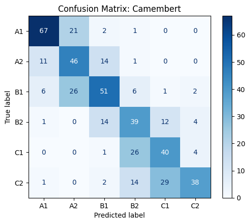
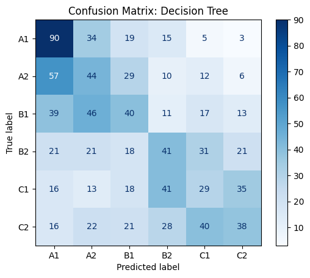

# Predicting the Difficulty of French Text Using AI

**Group OMEGA: Mathias Häberli, Sophie Daya**

## Project Description
This project aims to predict the difficulty level of French sentences using various machine learning models, including Logistic Regression, KNN, Decision Tree, Random Forest, and CamemBERT. Throughout this README and the accompanying GitHub repository, we will explore which model is the most capable of classifying French texts according to their difficulty level. Additionally, after demonstrating and training the best model, we will apply it in a real-world scenario: an application.

We are proud to present the first application from our startup, "LogoRank." We hope this README will not only convince you of our approach but also provide you with valuable insights into text classification. Join us on this exciting journey as we push the boundaries of natural language processing and machine learning!

PS: Part ... to ..., you can directly go to ...

Directories and Files
App

App_Code_Streamlit.py
dataset

sample_submission.csv
training_data.csv
unlabelled_test_data.csv
images

Confusion_Matrix_Camembert.png
Confusion_Matrix_Decision_Tree.png
Confusion_Matrix_Erroneous_Predictions.png
Confusion_Matrix_KNN.png
Confusion_Matrix_Logistic.png
Confusion_Matrix_Random_Forest.png
Distribution_Error_Types.png
Distribution_Lengths.png
Types_Errors.png
Types_Words_Errors.png
models

camembert_model.py
## Deliverables
- **GitHub:** [GitHub Project Page](https://github.com/matiti5132421/Group_Omega_Mathias_Haberli_Sophie_Daya)
- **Code:** [Jupyter Notebook](https://colab.research.google.com/drive/1qFdVwjp82fv_aWV2Qpf-62F4_Zq41fXt?usp=sharing)
- **Youtube:** [App Presentation Video](https://youtu.be/Nv-kFxzV-Ws)
- **Kaggle:** [Kaggle Competition](https://www.kaggle.com/competitions/predicting-the-difficulty-of-a-french-text-e4s/overview)
- **Waitlist:** [Waitlist for our App](https://docs.google.com/forms/d/e/1FAIpQLSc-g1LlU-5fFoKpCgv2n0rtrsx3aghzOXvipW8a8PQBskdMQg/viewform)

## Table of Contents
1. [Introduction](#introduction)
2. [Data Presentation](#data-presentation)
   - 2.1. [Data Overview](#data-overview)
   - 2.2. [Data Preparation](#data-preparation)
3. [Logistic Regression Model](#logistic-regression-model)
   - 3.1. [Definition of the Model](#definition-of-the-model)
   - 3.2. [Code Explanation](#code-explanation)
   - 3.3. [Metrics and Results](#metrics-and-results)
4. [K-Nearest Neighbors (KNN) Model](#k-nearest-neighbors-knn-model)
   - 4.1. [Definition of the Model](#definition-of-the-model-1)
   - 4.2. [Code Explanation](#code-explanation-1)
   - 4.3. [Metrics and Results](#metrics-and-results-1)
5. [Decision Tree Model](#decision-tree-model)
   - 5.1. [Definition of the Model](#definition-of-the-model-2)
   - 5.2. [Code Explanation](#code-explanation-2)
   - 5.3. [Metrics and Results](#metrics-and-results-2)
6. [Random Forest Model](#random-forest-model)
   - 6.1. [Definition of the Model](#definition-of-the-model-3)
   - 6.2. [Code Explanation](#code-explanation-3)
   - 6.3. [Metrics and Results](#metrics-and-results-3)
7. [CamemBERT Model](#camembert-model)
   - 7.1. [Definition of the Model](#definition-of-the-model-4)
   - 7.2. [Code Explanation](#code-explanation-4)
   - 7.3. [Metrics and Results](#metrics-and-results-4)
8. [Results](#results)
   - 8.1. [Comparison Table](#comparison-table)
   - 8.2. [Comparison of Confusion Matrix](#comparison-of-confusion-matrix)
   - 8.3. [The Best Model CamemBERT](#the-best-model-camembert)
   - 8.4. [Our Ranking on Kaggle](#our-ranking-on-kaggle)
9. [Additional Analysis](#additional-analysis)
   - [Sentence Length Analysis](#sentence-length-analysis)
   - [POS Tag Analysis](#pos-tag-analysis)
10. [Our App LogoRank](#our-app-logorank)
   - [Principle and functionality](#principle-and-functionality)
   - [Demonstration in a video](#Demonstration-in-a-video)
11. [Conclusion](#conclusion)
12. [References and Participation Report](#references)

## 1. Introduction
To begin with, it is essential to understand that multiple approaches were available to develop our French text difficulty classification model. We experimented with five different machine learning models to achieve the best classification results. These models include:

- Logistic Regression
- K-Nearest Neighbors (KNN)
- Decision Tree
- Random Forest
- CamemBERT from BERT

Each model has its strengths, weaknesses, and specific use cases. Therefore, it was crucial for us to determine which of these models was the most suitable for our final application by directly testing each model on the data we had available.

These machine learning models follow a similar process. They are first trained on labeled data, and their parameters are optimized to achieve the best results on a portion of the data reserved for testing the model. Finally, we can use the trained model on real, unlabeled data.

Without further ado, let's begin with an overview of the datasets we used!

## 2. Data
### 2.1. Data Presentation
To train our models, we used various datasets. The most important was the `training_data.csv`, which you can find here: [training_data.csv](dataset/training_data.csv). This dataset consists of 4800 French texts organized as follows:

| id  | sentence                                                                 | difficulty |
| --- | ------------------------------------------------------------------------ | ---------- |
| 0   | Les coûts kilométriques réels peuvent diverger...                        | C1         |
| 1   | Le bleu, c'est ma couleur préférée mais je n'a...                        | A1         |
| 2   | Le test de niveau en français est sur le site ...                        | A1         |
| 3   | Est-ce que ton mari est aussi de Boston?                                 | A1         |
| 4   | Dans les écoles de commerce, dans les couloirs...                        | B1         |
| ... | ...                                                                      | ...        |
| 4795| C'est pourquoi, il décida de remplacer les hab...                        | B2         |
| 4796| Il avait une de ces pâleurs splendides qui don...                        | C1         |
| 4797| Et le premier samedi de chaque mois, venez ren...                        | A2         |
| 4798| Les coûts liés à la journalisation n'étant pas...                        | C2         |
| 4799| Sur le sable, la mer haletait de toute la resp...                        | C2         |

The `difficulty` column indicates the difficulty level of the sentences, ranging from A1 to C2, with A1 being the simplest and C2 being the most complex.

For each model, we divided the data into two parts: the training sample to train our models, and the validation sample to test the models and adjust parameters if necessary. We typically used an 80/20 split, with 80% of the data for training and 20% for validation. Other splits are also possible. Concretly, in python code it looks like this:

### 2.2. Data Preparation

Concretly, in python code it looks like this:

```python
# Separate features and labels
X = training_data_pd['sentence']  # Features (text data)
y = training_data_pd['difficulty']  # Labels (difficulty level)
```
In this step, we first separate our dataset into features and labels. The features (X) are the sentences we want to classify, and the labels (y) are the difficulty levels assigned to each sentence.

```python
# Encode labels
label_encoder = LabelEncoder()
y_encoded = label_encoder.fit_transform(y)
```
Since machine learning models work better with numeric data, we need to convert the text labels (difficulty levels) into numerical values. The LabelEncoder is used to transform the difficulty levels into numeric form, making them suitable for training our model.

```python
# Split the data into training and validation sets
X_train, X_val, y_train, y_val = train_test_split(X, y_encoded, test_size=0.2, random_state=42)
```
Here, we split our dataset into two parts: training and validation sets. The training set (X_train, y_train) is used to train the model, while the validation set (X_val, y_val) is used to evaluate its performance. We use 80% of the data for training and 20% for validation. The random_state parameter ensures that we get the same split every time we run the code.

```python
# Text Vectorization
vectorizer = TfidfVectorizer()
X_train_transformed = vectorizer.fit_transform(X_train)
X_val_transformed = vectorizer.transform(X_val)
```
To feed our text data into a machine learning model, we need to convert it into a numerical format. The TfidfVectorizer transforms the sentences into a matrix of numerical values, where each value represents the importance of a word in a sentence relative to the entire dataset. We first fit the vectorizer on the training data (fit_transform), and then apply the same transformation to the validation data (transform).

By following these steps, we prepare our text data for machine learning models, ensuring that it is in the right format and properly split into training and validation sets for effective model training and evaluation.

## 3. Logistic Regression Model

### 3.1. Definition of the Model
Logistic Regression is a popular and straightforward model used to classify data into different categories. In this section, we use Logistic Regression to predict the difficulty levels of French sentences. This model helps us decide which difficulty level a sentence belongs to based on the data it has learned from.

#### How Does the Logistic Regression Model Work?

1. *Probability Estimation*: Logistic Regression calculates the likelihood that a given sentence belongs to a specific difficulty level. It does this by using a special function called the sigmoid function, which converts the input values into a probability between 0 and 1.

2. *Classification*: Based on these probabilities, the model assigns the sentence to a difficulty level. For example, if the probability of a sentence being a particular level is higher than 50%, it is classified as that level.

#### Strengths and Weaknesses

- *Strengths*:
  - *Simplicity*: Logistic Regression is easy to understand and implement.
  - *Efficiency*: It works well with large datasets and is computationally efficient.
  - *Interpretability*: The results are easy to interpret, making it clear how the model is making decisions.

- *Weaknesses*:
  - *Linearity*: It assumes a linear relationship between the features and the outcome, which may not always be the case.
  - *Limited Complexity*: It might not perform well with very complex data patterns or when the data has many interactions.

#### Practical Uses

Logistic Regression is widely used in various fields. For instance, in healthcare, it can predict whether a patient has a certain disease based on their medical history and test results. In marketing, it can classify whether a customer will buy a product based on their past behavior.

By understanding these aspects, we can better appreciate the strengths and limitations of Logistic Regression and decide if it is the right choice for our text classification task.

### 3.2. Code Explanation

Let's now take a closer look at how the Python code works for the Logistic Regression model, assuming that our data has already been prepared as we discussed earlier.
```python
# Logistic Regression Model
logistic_model = LogisticRegression(max_iter=1000)
```
We start by creating an instance of the Logistic Regression model with a maximum of 1000 iterations. This helps ensure the model has enough opportunities to converge to a solution.
```python
# Hyperparameter tuning
param_grid = {'C': [0.1, 1, 10], 'solver': ['liblinear', 'lbfgs']}  # Adjust based on Logistic Regression needs
grid_search = GridSearchCV(logistic_model, param_grid, cv=5, scoring='accuracy')
grid_search.fit(X_train_transformed, y_train)
```
Hyperparameters are settings that can be adjusted to improve the performance of the model. Here, we use GridSearchCV to try different values of the `C` parameter (which controls the regularization strength) and the `solver` (which determines the algorithm to use for optimization). GridSearchCV runs the model multiple times (with 5-fold cross-validation) to find the best combination of these hyperparameters.

```python
# Best Logistic Regression model
best_logistic = grid_search.best_estimator_
```
After testing different hyperparameter combinations, GridSearchCV selects the best-performing model based on accuracy.

```python
# Predictions and evaluation
y_pred = best_logistic.predict(X_val_transformed)
report = classification_report(y_val, y_pred, target_names=label_encoder.classes_, output_dict=True)
```
The selected model is then used to make predictions on the validation data. We generate a classification report that includes metrics such as precision, recall, and F1-score for each difficulty level.

```python
# Predictions and evaluation
y_pred = best_logistic.predict(X_val_transformed)
report = classification_report(y_val, y_pred, target_names=label_encoder.classes_, output_dict=True)
```
Finally, we convert the classification report into a DataFrame for easier viewing and further analysis.

This code helps us train and evaluate the Logistic Regression model, ensuring we optimize its performance for predicting the difficulty of French sentences.

### 3.3. Metrics and Results

We can now print the results and metrics of the Logistic Regression model to see how it performs:

#### Logistic Regression Model Evaluation (Class-wise)

| Difficulty Level | Precision | Recall | F1-Score |
|------------------|-----------|--------|----------|
| A1               | 0.537313  | 0.650602 | 0.588556 |
| A2               | 0.345029  | 0.373418 | 0.358663 |
| B1               | 0.425373  | 0.343373 | 0.380000 |
| B2               | 0.492063  | 0.405229 | 0.444444 |
| C1               | 0.455782  | 0.440789 | 0.448161 |
| C2               | 0.524862  | 0.575758 | 0.549133 |

#### Logistic Regression Model Evaluation (Overall)

| Metric             | Value     |
|--------------------|-----------|
| Precision          | 0.464049  |
| Recall             | 0.466667  |
| F1-Score           | 0.462684  |
| Accuracy           | 0.466667  |

#### Explanation of the Metrics

- *Precision*: This measures how many of the predicted positive instances are actually positive. For example, a precision of 0.537313 for level A1 means that approximately 53.73% of the sentences predicted as A1 are truly A1.

- *Recall*: This measures how many of the actual positive instances are correctly predicted. A recall of 0.650602 for level A1 indicates that the model correctly identifies 65.06% of the A1 sentences.

- *F1-Score*: This is the harmonic mean of precision and recall, providing a single metric that balances both. For level A1, the F1-score is 0.588556.

- *Accuracy*: This measures the proportion of correct predictions out of all predictions made. The overall accuracy of 0.466667 means that the model correctly predicts the difficulty level of approximately 46.67% of the sentences.

#### Performance Analysis

- *A1 Level*: The model performs reasonably well for the A1 level with the highest recall (0.650602) among all levels, meaning it is good at identifying A1 sentences. However, the precision is moderate, indicating some false positives.

- *A2 Level*: The performance is lower with both precision (0.345029) and recall (0.373418) indicating the model struggles more with this level.

- *B1 and B2 Levels*: The model's performance is balanced for these levels, with moderate precision and recall values. The F1-scores for B1 and B2 are 0.380000 and 0.444444, respectively, suggesting the model is less consistent in predicting these levels.

- *C1 and C2 Levels*: The model shows better performance for C2 compared to C1, with higher precision (0.524862) and recall (0.575758). The F1-score of 0.549133 for C2 is the highest among the higher difficulty levels.

Overall, the Logistic Regression model demonstrates varying performance across different difficulty levels, with the best results for A1 and C2 levels. These insights can help in understanding where the model excels and where improvements are needed.

## 4. K-Nearest Neighbors (KNN)

The K-Nearest Neighbors (KNN) model is a simple, yet effective, method used for classification tasks. In this section, we utilize KNN to predict the difficulty levels of French sentences. This model classifies sentences based on their similarity to other sentences in the training data.

### 4.1. Definition of the Model

1. *Similarity Measure*: KNN calculates the similarity between sentences using a distance metric (e.g., Euclidean distance). It finds the 'k' closest sentences (neighbors) in the training data to the sentence being classified.

2. *Majority Vote*: The model assigns the sentence to the difficulty level most common among its 'k' nearest neighbors. For example, if most of the closest neighbors belong to level A1, the sentence is classified as A1.

#### Strengths and Weaknesses

- *Strengths*:
  - *Simplicity*: KNN is easy to understand and implement.
  - *Non-parametric*: It makes no assumptions about the underlying data distribution.
  - *Flexibility*: It can be used for both classification and regression tasks.

- *Weaknesses*:
  - *Computational Cost*: KNN can be slow, especially with large datasets, as it computes distances for all instances.
  - *Sensitivity to Noise*: It is sensitive to noisy data and irrelevant features.
  - *Choosing 'k'*: The performance heavily depends on the choice of 'k', the number of neighbors.

#### Practical Uses

KNN is used in various applications such as pattern recognition, recommender systems, and anomaly detection. For instance, in image recognition, KNN can classify images based on their similarity to labeled images in the dataset.

By understanding the strengths and weaknesses of KNN, we can effectively apply this model to our text classification task and leverage its capabilities for accurate predictions.

### 4.2. Code Explanation

Let's walk through the Python code used to implement the K-Nearest Neighbors (KNN) model for predicting the difficulty levels of French sentences:

```python
# KNN Model
knn = KNeighborsClassifier()
```
This line initializes the KNN model using the `KNeighborsClassifier` from the `sklearn` library. The KNN model will be used to classify sentences based on their similarity to other sentences in the training data.

```python
# Hyperparameter tuning
param_grid = {'n_neighbors': [3, 5, 7, 9], 'weights': ['uniform', 'distance']}
grid_search = GridSearchCV(knn, param_grid, cv=5, scoring='accuracy')
```
Here, we define a grid of hyperparameters to tune the KNN model:
- `n_neighbors`: The number of nearest neighbors to consider for classification.
- `weights`: The weight function used in prediction. 'uniform' means all neighbors are weighted equally, while 'distance' means closer neighbors have more influence.
`GridSearchCV` is used to perform an exhaustive search over the specified hyperparameter grid with 5-fold cross-validation. The `scoring='accuracy'` parameter ensures that the model is evaluated based on accuracy.

```python
grid_search.fit(X_train_transformed, y_train)
```
This line fits the grid search to the transformed training data (`X_train_transformed` and `y_train`). The grid search will try all combinations of hyperparameters and select the best one based on cross-validated accuracy.

```python
# Best KNN model
best_knn = grid_search.best_estimator_
```
After the grid search is complete, `best_knn` will hold the KNN model with the best combination of hyperparameters found during the search.

```python
# Predictions and evaluation
y_pred = best_knn.predict(X_val_transformed)
report = classification_report(y_val, y_pred, target_names=label_encoder.classes_, output_dict=True)
```
Finally, we use the best KNN model to make predictions on the validation data (`X_val_transformed`). The `classification_report` function generates a detailed report of the model's performance, including precision, recall, and F1-score for each difficulty level. The `target_names` parameter ensures that the report uses the original class labels (A1, A2, B1, B2, C1, C2), and `output_dict=True` returns the report as a dictionary for further analysis.

### 4.3. Metrics and Results

#### KNN Model Evaluation (Class-wise)

| Difficulty Level | Precision | Recall | F1-Score |
|------------------|-----------|--------|----------|
| A1               | 0.335052  | 0.783133 | 0.469314 |
| A2               | 0.234043  | 0.278481 | 0.254335 |
| B1               | 0.270677  | 0.216867 | 0.240803 |
| B2               | 0.494118  | 0.274510 | 0.352941 |
| C1               | 0.506667  | 0.250000 | 0.334802 |
| C2               | 0.593407  | 0.327273 | 0.421875 |

#### KNN Model Evaluation (Overall)

| Model | Precision | Recall | F1-Score | Accuracy |
|-------|-----------|--------|----------|----------|
| KNN   | 0.404224  | 0.358333 | 0.34642  | 0.358333 |

#### Commentary

The KNN model shows varying performance across different difficulty levels. It performs best in terms of precision and recall for the A1 level, indicating that it can accurately identify simpler sentences. However, the performance drops for higher difficulty levels like A2, B1, B2, C1, and C2. The overall accuracy is relatively low at 35.83%, suggesting that while the KNN model can classify some sentences correctly, it struggles with others, particularly those at higher difficulty levels.

## 5. Decision Tree

The Decision Tree model is a popular method used for classification tasks. In this section, we use Decision Trees to predict the difficulty levels of French sentences. This model makes decisions based on a series of questions about the input features, leading to a final classification.

### 5.1. Definition of the Model

1. *Tree Structure*: A Decision Tree consists of nodes and branches. Each node represents a feature or attribute, and each branch represents a decision rule. The leaves represent the final classification.

2. *Splitting*: The tree splits the data based on certain criteria (e.g., Gini impurity or information gain) to maximize the homogeneity of the resulting nodes. The process continues recursively until a stopping condition is met.

#### Strengths and Weaknesses

- *Strengths*:
  - *Interpretability*: Decision Trees are easy to understand and visualize.
  - *Non-linear Relationships*: They can capture non-linear relationships between features and target labels.
  - *Handling Missing Data*: They can handle missing values and maintain performance.

- *Weaknesses*:
  - *Overfitting*: Decision Trees can easily overfit, especially with complex trees.
  - *Instability*: Small changes in the data can lead to different tree structures.
  - *Bias*: They can be biased to dominant classes if not properly tuned.

#### Practical Uses

Decision Trees are widely used in various fields such as finance for credit scoring, in healthcare for diagnosing diseases, and in marketing for customer segmentation. They are effective in scenarios where interpretability and understanding of the decision-making process are crucial.

Understanding the strengths and weaknesses of Decision Trees allows us to apply this model effectively to our text classification task and leverage its ability to make clear, interpretable decisions.

### 5.2. Code Explanation

```python
# Decision Tree Model
decision_tree = DecisionTreeClassifier()
```
**Decision Tree Initialization**: The `DecisionTreeClassifier` from the `sklearn` library is initialized. This classifier will be used to build the decision tree model.

```python
# Hyperparameter tuning using RandomizedSearchCV
param_dist = {
    'max_depth': [None, 10, 20, 30, 40, 50, 60],
    'min_samples_split': randint(2, 20),
    'min_samples_leaf': randint(1, 20),
    'criterion': ['gini', 'entropy'],
    'splitter': ['best', 'random']
}
```
**Hyperparameter Tuning**: We use `RandomizedSearchCV` to tune the hyperparameters of the Decision Tree model. The `param_dist` dictionary specifies the range of values for the hyperparameters:

- `max_depth`: The maximum depth of the tree.
- `min_samples_split`: The minimum number of samples required to split an internal node.
- `min_samples_leaf`: The minimum number of samples required to be at a leaf node.
- `criterion`: The function to measure the quality of a split ('gini' or 'entropy').
- `splitter`: The strategy used to choose the split at each node ('best' or 'random').

```python
random_search = RandomizedSearchCV(decision_tree, param_distributions=param_dist, n_iter=100, cv=5, scoring='accuracy', random_state=42, n_jobs=-1)
random_search.fit(X_train_transformed, y_train)
```
**Random Search**: `RandomizedSearchCV` performs a random search over the specified hyperparameter distributions with 100 iterations (`n_iter=100`) and 5-fold cross-validation (`cv=5`). The `scoring='accuracy'` parameter ensures that the model is evaluated based on accuracy. The `random_search.fit(X_train_transformed, y_train)` line fits the model to the transformed training data.

```python
# Best Decision Tree model
best_decision_tree = random_search.best_estimator_
```
**Best Model Selection**: The best combination of hyperparameters is selected, and the best model is stored in `best_decision_tree`.

```python
# Predictions and evaluation
y_pred = best_decision_tree.predict(X_val_transformed)
report = classification_report(y_val, y_pred, target_names=label_encoder.classes_, output_dict=True)
```
**Predictions and Evaluation**: The best Decision Tree model is used to make predictions on the validation data (`X_val_transformed`). The `classification_report` function generates a detailed report of the model's performance, including precision, recall, and F1-score for each difficulty level. The results are stored in a dictionary for further analysis.

### 5.3. Metrics and Results

#### Decision Tree Model Evaluation (Class-wise)

| Difficulty Level | Precision | Recall   | F1-Score |
|------------------|-----------|----------|----------|
| A1               | 0.376569  | 0.542169 | 0.444444 |
| A2               | 0.244444  | 0.278481 | 0.260355 |
| B1               | 0.275862  | 0.240964 | 0.257235 |
| B2               | 0.280822  | 0.267974 | 0.274247 |
| C1               | 0.216418  | 0.190789 | 0.202797 |
| C2               | 0.327586  | 0.230303 | 0.270463 |

#### Decision Tree Model Evaluation (Overall)

| Model         | Precision | Recall   | F1-Score | Accuracy |
|---------------|-----------|----------|----------|----------|
| Decision Tree | 0.288374  | 0.29375  | 0.286486 | 0.29375  |

#### Commentary

The Decision Tree model demonstrates moderate performance across different difficulty levels. It performs best in terms of precision and recall for the A1 level, which indicates that it can reasonably identify simpler sentences. However, the performance decreases for higher difficulty levels such as A2, B1, B2, C1, and C2. The overall accuracy is 29.38%, indicating that while the Decision Tree model can classify some sentences correctly, it faces challenges particularly with higher difficulty levels. This suggests that the model may benefit from further tuning or the use of more complex algorithms to improve its performance.

## 6. Random Forest

The Random Forest model is an ensemble learning method that combines multiple decision trees to improve classification accuracy. In this section, we use Random Forest to predict the difficulty levels of French sentences. This model aggregates the predictions of several decision trees to make a final decision.

### 6.1. Definition of the Model

1. *Ensemble of Trees*: Random Forest constructs multiple decision trees during training. Each tree is trained on a random subset of the training data and features.

2. *Majority Vote*: The model makes predictions by aggregating the votes of all the individual trees. The class that receives the majority of votes is chosen as the final prediction.

#### Strengths and Weaknesses

- *Strengths*:
  - *Accuracy*: Random Forest typically provides high accuracy by reducing overfitting.
  - *Robustness*: It is less sensitive to noisy data and irrelevant features due to the ensemble approach.
  - *Feature Importance*: The model can provide insights into feature importance, indicating which features are most influential in making predictions.

- *Weaknesses*:
  - *Complexity*: The model can be complex and require more computational resources compared to simpler models.
  - *Interpretability*: With many trees, it can be challenging to interpret how the final decision is made.

#### Practical Uses

Random Forest is widely used in applications such as fraud detection, medical diagnosis, and stock market analysis. For example, in healthcare, it can predict disease outcomes based on patient data, and in finance, it can identify fraudulent transactions.

By leveraging the strengths of Random Forest, we can achieve more reliable and accurate predictions for our text classification task.

### 6.2. Code Explanation

```python
# Random Forest Model
random_forest = RandomForestClassifier()
```
**Random Forest Initialization**: The `RandomForestClassifier` from the `sklearn` library is initialized. This classifier will be used to build the random forest model.

```python
# Hyperparameter tuning with reduced parameters
param_grid = {
    'n_estimators': [100, 150],
    'max_depth': [None, 20],
    'min_samples_split': [2, 5],
    'min_samples_leaf': [1, 2]
}
```
**Hyperparameter Tuning**: We use `GridSearchCV` to tune the hyperparameters of the Random Forest model. The `param_grid` dictionary specifies the range of values for the hyperparameters:

- `n_estimators`: The number of trees in the forest.
- `max_depth`: The maximum depth of the tree.
- `min_samples_split`: The minimum number of samples required to split an internal node.
- `min_samples_leaf`: The minimum number of samples required to be at a leaf node.

```python
grid_search = GridSearchCV(random_forest, param_grid, cv=3, scoring='accuracy')
grid_search.fit(X_train_transformed, y_train)
```
**Grid Search**: `GridSearchCV` performs an exhaustive search over the specified hyperparameter grid with 3-fold cross-validation (`cv=3`). The `scoring='accuracy'` parameter ensures that the model is evaluated based on accuracy. The `grid_search.fit(X_train_transformed, y_train)` line fits the model to the transformed training data.

```python
# Best Random Forest model
best_random_forest = grid_search.best_estimator_
```
**Best Model Selection**: The best combination of hyperparameters is selected, and the best model is stored in `best_random_forest`.

```python
# Predictions and evaluation
y_pred = best_random_forest.predict(X_val_transformed)
report = classification_report(y_val, y_pred, target_names=label_encoder.classes_, output_dict=True)
```
**Predictions and Evaluation**: The best Random Forest model is used to make predictions on the validation data (`X_val_transformed`). The `classification_report` function generates a detailed report of the model's performance, including precision, recall, and F1-score for each difficulty level. The results are stored in a dictionary for further analysis.

### 6.3. Metrics and Results

#### Random Forest Model Evaluation (Class-wise)

| Difficulty Level | Precision | Recall   | F1-Score |
|------------------|-----------|----------|----------|
| A1               | 0.468750  | 0.813253 | 0.594714 |
| A2               | 0.344000  | 0.272152 | 0.303887 |
| B1               | 0.341880  | 0.240964 | 0.282686 |
| B2               | 0.421875  | 0.352941 | 0.384342 |
| C1               | 0.394558  | 0.381579 | 0.387960 |
| C2               | 0.445161  | 0.418182 | 0.431250 |

#### Random Forest Model Evaluation (Overall)

| Model         | Precision | Recall   | F1-Score | Accuracy |
|---------------|-----------|----------|----------|----------|
| Random Forest | 0.403008  | 0.415625 | 0.398534 | 0.415625 |

#### Commentary

The Random Forest model shows strong performance, particularly for the A1 difficulty level, with high precision and recall. However, its performance decreases for higher difficulty levels such as A2, B1, B2, C1, and C2, indicating some difficulty in distinguishing more complex sentences. The overall accuracy is 41.56%, suggesting that the Random Forest model can classify sentences with reasonable accuracy, but there is still room for improvement, especially for the more challenging levels.

## 7. CamemBERT Model

CamemBERT is a transformer-based model specifically designed for the French language, building on the BERT (Bidirectional Encoder Representations from Transformers) architecture. It excels at understanding the context of words in sentences, making it a powerful tool for text classification tasks. In this section, we use CamemBERT to predict the difficulty levels of French sentences.

### 7.1. Definition of the Model

1. *Pre-training*: CamemBERT is pre-trained on a large corpus of French text using a masked language modeling objective. During pre-training, the model learns to predict missing words in sentences, allowing it to understand context and capture nuanced language patterns.

2. *Fine-tuning*: After pre-training, CamemBERT is fine-tuned on a specific task, such as text classification. During fine-tuning, the model's parameters are adjusted using labeled data to optimize performance on the target task.

3. *Transformer Architecture*: CamemBERT uses a transformer architecture, which includes self-attention mechanisms to weigh the importance of different words in a sentence. This allows the model to capture long-range dependencies and contextual information.

#### Strengths and Weaknesses

- *Strengths*:
  - *Contextual Understanding*: CamemBERT excels at understanding the context of words within sentences, making it highly accurate for language-related tasks.
  - *Pre-training*: The extensive pre-training on a large French corpus provides a strong foundation for various downstream tasks.
  - *Transfer Learning*: Fine-tuning on specific tasks leverages the model's pre-trained knowledge, allowing for efficient adaptation to new tasks.

- *Weaknesses*:
  - *Computational Resources*: CamemBERT requires significant computational power and memory, especially during training.
  - *Complexity*: The transformer architecture can be complex to understand and implement compared to simpler models.

#### Practical Uses

CamemBERT is used in applications such as text classification, sentiment analysis, and named entity recognition. For instance, it can classify customer reviews based on sentiment, identify named entities in legal documents, and predict the difficulty level of educational content.

By leveraging the strengths of CamemBERT, we can achieve highly accurate and context-aware predictions for our text classification task.

### 7.2. Code Explanation

The python code of the CamemBERT model is quite important, in consequences let's focus on most important parts. But you can find all the code on the section 6.1. of our Jupyter Notebook, here:  [Jupyter_Notebook.ipynb](Jupyter_Notebook.ipynb)

```python
# Function to encode data
def encode_data(tokenizer, df):
    texts = df['sentence'].tolist()
    labels = df['difficulty'].map({'A1': 0, 'A2': 1, 'B1': 2, 'B2': 3, 'C1': 4, 'C2': 5}).tolist()
    encodings = tokenizer(texts, truncation=True, padding='max_length', max_length=128)
    return Dataset.from_dict({
        'input_ids': encodings['input_ids'],
        'attention_mask': encodings['attention_mask'],
        'labels': labels
    })
# Load the model
model = CamembertForSequenceClassification.from_pretrained('camembert-base', num_labels=6)
```
**Data Encoding**: This function encodes the text data and maps the difficulty labels to numerical values. The tokenizer transforms the sentences into input IDs and attention masks.

**Model Initialization**: The `CamembertForSequenceClassification` model is loaded with a pre-trained 'camembert-base' and configured for a 6-class classification task.

```python
# Define training arguments
training_args = TrainingArguments(
    output_dir='./results',
    num_train_epochs=6,
    per_device_train_batch_size=21,
    warmup_steps=500,
    weight_decay=0.01,
    logging_dir='./logs',
    logging_steps=50,
    learning_rate=15e-5,
    fp16=False,
    evaluation_strategy="epoch",
    save_strategy="epoch",
    load_best_model_at_end=True,
    metric_for_best_model='accuracy',
    greater_is_better=True
)
```
**Training Arguments**: These arguments define the training configuration for the model. Here are the key parameters and their roles:

- `output_dir='./results'`: Specifies the directory where the model checkpoints and logs will be saved. This helps in organizing and storing the model's progress and outputs during training.
- `num_train_epochs=6`: Sets the number of training epochs to 6. An epoch is one complete pass through the entire training dataset. This means the model will train on the entire dataset 6 times to learn the patterns in the data.
- `per_device_train_batch_size=21`: Defines the batch size for training, which is the number of samples processed before the model's internal parameters are updated. A batch size of 21 means that the model will process 21 sentences at a time.
- `warmup_steps=500`: Specifies the number of steps to gradually increase the learning rate from 0 to its set value. This warm-up period helps in stabilizing the training process, especially at the beginning.
- `weight_decay=0.01`: Applies weight decay (regularization) to the optimizer to prevent overfitting by adding a penalty for large weights, encouraging the model to learn simpler patterns that generalize better.
- `logging_dir='./logs'`: Specifies the directory where the training logs, such as loss and accuracy per step, will be stored. This helps in monitoring the training process.
- `logging_steps=50`: Logs training metrics (e.g., loss, accuracy) every 50 steps. This frequency of logging helps in tracking the model's performance and training progress without too much overhead.
- `learning_rate=15e-5`: Sets the learning rate for the optimizer, which controls how much to change the model's parameters at each step. A learning rate of 15e-5 (or 0.00015) is a relatively small value to ensure gradual and stable training.
- `fp16=False`: Disables mixed precision training (16-bit floating-point), which can be used to speed up training on compatible hardware. Here, we use standard 32-bit precision.
- `evaluation_strategy="epoch"`: Evaluates the model's performance on the validation set at the end of each epoch. This helps in assessing how well the model is learning and adjusting hyperparameters if necessary.
- `save_strategy="epoch"`: Saves a checkpoint of the model at the end of each epoch. This allows for recovering the best version of the model in case of interruptions and for future fine-tuning.
- `load_best_model_at_end=True`: Ensures that the best model, based on evaluation metrics, is loaded at the end of training. This helps in deploying the most accurate model.
- `metric_for_best_model='accuracy'`: Uses accuracy as the key metric to evaluate and compare model performance. The model with the highest accuracy on the validation set will be considered the best.
- `greater_is_better=True`: Indicates that higher values of the specified metric (accuracy) are better, guiding the training process to maximize this metric.

These parameters are crucial for optimizing the model's performance. In our project, we determined these settings through a systematic hyperparameter optimization process, iteratively testing different combinations to identify the most effective configuration.

```python
# Initialize the Trainer with added compute_metrics for dynamic metric calculation
trainer = Trainer(
    model=model,
    args=training_args,
    train_dataset=train_dataset,
    eval_dataset=val_dataset,
    compute_metrics=compute_metrics,
    callbacks=[EarlyStoppingCallback(early_stopping_patience=3)]

# Train the model
trainer.train()

# Evaluate the model
predictions, labels, _ = trainer.predict(val_dataset)
predictions = np.argmax(predictions, axis=-1)

# Generate classification report
report = classification_report(labels, predictions, target_names=['A1', 'A2', 'B1', 'B2', 'C1', 'C2'], output_dict=True)
```
**Trainer Initialization**: 
We configure the `Trainer` with several components:
- **model**: Specifies the CamemBERT model pre-loaded for training.
- **args**: Contains the training arguments such as batch size, learning rate, previously defined.
- **train_dataset and eval_dataset**: Datasets designated for training and evaluation phases.
- **compute_metrics**: A function to compute evaluation metrics, aiding in performance monitoring.
- **callbacks**: Includes `EarlyStoppingCallback` with a patience of 3 epochs to prevent overfitting by stopping training if there is no improvement.

**Model Training**: 
The `trainer.train()` method initiates the model training according to the set parameters and datasets.

**Model Evaluation**:
- Post-training, `trainer.predict(val_dataset)` is employed to make predictions on the validation set.
- `np.argmax(predictions, axis=-1)`: Converts model logits to class indices, identifying the class with the highest probability.

**Classification Report**:
- `classification_report` provides a detailed performance analysis, showing precision, recall, and F1-score for each difficulty level (A1, A2, B1, B2, C1, C2).
- Setting `output_dict=True` formats the report as a dictionary for ease of use in applications and further analyses.

This methodology ensures meticulous tracking and optimization of each phase from training through to evaluation for optimal outcomes.

### 7.3. Metrics and Results

#### CamemBERT Model Evaluation (Class-wise)

| Difficulty Level | Precision | Recall   | F1-Score |
|------------------|-----------|----------|----------|
| A1               | 0.779070  | 0.736264 | 0.757062 |
| A2               | 0.494624  | 0.638889 | 0.557576 |
| B1               | 0.607143  | 0.554348 | 0.579545 |
| B2               | 0.448276  | 0.557143 | 0.496815 |
| C1               | 0.487805  | 0.563380 | 0.522876 |
| C2               | 0.791667  | 0.452381 | 0.575758 |

#### CamemBERT Model Evaluation (Overall)

| Model      | Precision | Recall   | F1-Score | Accuracy |
|------------|-----------|----------|----------|----------|
| CamemBERT  | 0.614331  | 0.585417 | 0.588794 | 0.585417 |

#### Commentary

The CamemBERT model demonstrates robust performance across various difficulty levels, particularly excelling in the precision and recall for the A1 level. This indicates that the model is highly effective in accurately identifying simpler sentences. While the model also shows good precision in the C2 level, its recall is lower, suggesting some challenges in consistently identifying the most complex sentences. Overall, the model achieves a solid accuracy of 58.54%, reflecting its capability to handle text classification with a nuanced understanding of French sentence complexity. This performance makes CamemBERT a strong candidate for tasks requiring detailed linguistic analysis, showing potential for further fine-tuning and application in more complex linguistic tasks.


## 8. Results

In this section, we will finally compare all the models we have explored by analyzing their performance metrics. We will then determine the best model that we have ultimately used for our application, as well as for achieving our best results on Kaggle!

### 8.1. Comparison Table

| Metric        | Logistic Regression | KNN     | Decision Tree | Random Forest | CamemBERT |
|---------------|---------------------|---------|---------------|---------------|-----------|
| Precision     | 0.464049            | 0.404224| 0.288374      | 0.403008      | 0.614331  |
| Recall        | 0.466667            | 0.358333| 0.29375       | 0.415625      | 0.585417  |
| F1-score      | 0.462684            | 0.34642 | 0.286486      | 0.398534      | 0.588794  |
| Accuracy      | 0.466667            | 0.358333| 0.29375       | 0.415625      | 0.585417  |


#### Identifying the Best Model: CamemBERT
- **Precision:** 0.614331
- **Recall:** 0.585417
- **F1-Score:** 0.588794
- **Accuracy:** 0.585417

The **CamemBERT** model steals the show with the highest scores across all metrics. What makes CamemBERT the star? It's all about understanding context. This model is built on the BERT architecture, which is designed to grasp the full context of a sentence by looking at words in relation to all the other words in a sentence, rather than one-at-a-time in order. Its excellence in precision indicates that when it predicts a sentence as being of a certain difficulty level, it's usually spot on. The high recall and accuracy further assure us that CamemBERT is reliable in identifying a wide range of sentence difficulties effectively.

#### The Underperformer: Decision Tree
- **Precision:** 0.288374
- **Recall:** 0.29375
- **F1-Score:** 0.286486
- **Accuracy:** 0.29375

On the flip side, the **Decision Tree** model lags significantly behind. Why does it falter? Decision Trees are generally simpler models that split data into branches based on certain decision nodes. This method can be quite effective for clear-cut, less complex data. However, when faced with the intricacies and subtleties of natural language processing, such as varying sentence structures and linguistic nuances, Decision Trees struggle. They tend to overfit on the training data, failing to generalize well on unseen data, which likely led to their lower performance metrics.

#### Summing Up
From our analysis, it's evident that the sophisticated **CamemBERT** is more equipped to tackle the complexities of language, providing robust and accurate classifications that are critical for our application's success. Meanwhile, simpler models like the Decision Tree might need more than just a few tweaks to compete in high-stakes environments such as Kaggle competitions.

By focusing on the right model, we harness the power of advanced AI to bridge human language and machine understanding, bringing top-tier natural language processing capabilities into practical applications.

### 8.2. Comparison of Confusion Matrix

### Analyzing Model Performance Through Confusion Matrices

Analyzing the confusion matrices for the CamemBERT and Decision Tree models provides a clear illustration of their performance disparities, particularly in handling the complexity of natural language.

<div align="center">
  
  
</div>

#### CamemBERT's Performance:
The confusion matrix for CamemBERT shows a well-distributed pattern of correct predictions across all classes. This model excels in accurately classifying sentences from easier levels (like A1) to more challenging levels (like C2). The relatively balanced off-diagonal elements suggest that while there are some misclassifications, they are mostly close misses within adjacent difficulty levels. This indicates a nuanced understanding of the French language and its various complexities, a strength inherent to the transformer-based architecture of CamemBERT, which leverages deep contextual embeddings.

#### Decision Tree's Struggles:
In contrast, the Decision Tree's confusion matrix displays more pronounced misclassifications across the board. The model shows a tendency to misclassify across a wider range of difficulty levels, with significant errors particularly in predicting more complex sentences (B2, C1, C2). These larger numbers of misclassifications away from the diagonal indicate a fundamental misunderstanding of sentence complexities and nuances. Decision Trees make decisions based on simpler, rule-based splits that do not capture the high-level features necessary for understanding language in depth. This leads to overfitting on training data, where the model learns specifics rather than generalizable patterns, resulting in poor performance on unseen data.


### 8.3. The Best Model CamemBERT

CamemBERT has clearly emerged as the frontrunner in our lineup of models, delivering stellar performance across the board. But what really sets CamemBERT apart?

#### Why CamemBERT Dominates:
- **Advanced Language Understanding**: Built on the robust BERT architecture, CamemBERT excels at grasping the subtleties of language by considering the entire context of sentences. This deep understanding allows it to outperform in precision, meaning it's remarkably accurate in classifying sentence difficulties correctly.

- **Superior Handling of Context**: Unlike simpler models that process words in isolation, CamemBERT views words in relation to their surrounding context, greatly enhancing its interpretative power. This is reflected in its high scores for both recall and accuracy, ensuring that it consistently identifies a wide range of sentence difficulties with high reliability.

- **Robust Architecture and Training**:
  - **Pre-trained Prowess**: CamemBERT's effectiveness is boosted by its pre-training on a vast corpus of French text, which helps it capture complex language patterns and contextual nuances vital for accurate text classification.
  - **Transfer Learning**: By fine-tuning the pre-trained model to our specific task, CamemBERT adapts to the peculiarities of classifying text difficulties, making it a model of choice for nuanced tasks.

#### Insights from the Confusion Matrix:
- **True Positives Galore**: The confusion matrix reveals that CamemBERT accurately classifies sentences into correct difficulty levels across the spectrum, highlighting its efficacy.
- **Minimized Misclassifications**: Compared to other models, CamemBERT shows fewer errors, demonstrating its precision and ability to avoid common pitfalls like overfitting.

#### In Summary:
CamemBERT's blend of contextual understanding, advanced training techniques, and a holistic approach to sentence analysis makes it the undisputed champion for our project. It not only understands the 'what' of the language but also the 'why' behind sentence structures, making it invaluable for tasks requiring a deep grasp of linguistic intricacies.

While other models have their merits, CamemBERT's robust capabilities and superior metrics underscore its suitability for high-stakes applications like ours. It's not just about classifying text; it's about understanding language at a level that most models aspire to.

### 8.4. Our Ranking on Kaggle

Finally, we took the plunge into the competitive world of Kaggle! Our challenge? To classify French texts by difficulty level. By deploying the mighty CamemBERT model and fine-tuning its parameters, we achieved an impressive accuracy of 59.1%! However, we landed in 17th place, which only fuels our ambition to push the boundaries further.

**Next Steps on Our Journey**:
- **Optimization**: We're pumped to enhance our model's accuracy. How? By embracing cutting-edge technologies like OpenAI to implement data augmentation strategies. This will enable our model to grasp the finer nuances of the French language even better.
- **Persistence Pays**: Our journey doesn’t end here. We’re motivated more than ever to climb the ranks in future competitions, proving that with persistence and the right technology, the sky's the limit!

**Check out the Competition**:
Feel free to dive into the leaderboard and see where we stand! Here's the link to the Kaggle competition we're battling out: [Predicting the Difficulty of French Texts](https://www.kaggle.com/competitions/predicting-the-difficulty-of-a-french-text-e4s/leaderboard).

We were Group OMEGA!

## 9. CamemBERT Error Analysis


### 9.1. Confusion Matrix of Erroneous Predictions

<div align="center">
  
</div>


### 9.2. Distribution of Error Type


### 9.3. Distribution of Sentence Lenghts


### 9.4. Type of Erros, Overestimation, Underestimation, Adjacent Level Confusion


### 9.5. Type of words errors (POS)


## 10. Our App LogoRank

### 10.1. Principle and Functionality

LogoRank is designed to enhance language learning by classifying French YouTube videos by interest and difficulty level (A1 to C2). This enables learners to find content that matches their skill level, guaranteeing an optimal learning experience.


Users start by entering specific keywords related to their interests. For example, if a user is interested in crochet, they can enter the keyword "crochet". This allows the app to focus on retrieving videos that are relevant to the user's interests. Then, users can select their proficiency level, ranging from A1 (beginner) to C2 (advanced). This is crucial because it allows LogoRank to filter and present videos that are appropriate for the user’s current language skills. This step ensures that the content is neither too challenging nor too simple, providing an optimal learning experience.

Once the keywords and skill level have been entered, LogoRank retrieves the YouTube videos linked to the keywords. The application then analyses the transcripts of these videos to determine their level of difficulty. This analysis is powered by the CamemBERT model, a sophisticated machine learning model specifically trained for the French language. The model considers various factors such as vocabulary complexity, sentence structure, and language usage to accurately classify the videos into difficulty levels (A1 to C2). 

After analyzing the videos, LogoRank presents a list of videos that match the selected difficulty level of the user. Each video is displayed with its title, a brief description, and the determined difficulty level. This user-friendly interface makes it easy for learners to browse through the results and select videos that are suitable for their learning needs. The interface of the app is designed to be simple and intuitive. Users can easily input their keywords and select their proficiency level. The results are presented in an easy-to-navigate format, showing video titles, the number of recommended videos and links to the videos. Users can quickly find and access the videos most relevant to their learning objectives.


### 10.3. Demonstration in a video

In this video, we will introduce you to our project and show you how LogoRank works! 🤩 

You will learn about:

- *Our mission* to make language learning more accessible and enjoyable.

- *The challenges* learners face in finding content that suits their level.

- *How LogoRank solves these problems* by classifying videos into difficulty levels (A1 to C2).

- *A live demonstration of our app*, including keyword search and video recommendations.

We hope this demonstration gives you a clear understanding of our application and how it can benefit French language learners! 📚😊

Don't forget to watch the video! : [Youtube Video](https://youtu.be/Nv-kFxzV-Ws)


## Conclusion
Summarize the findings, model performance, and insights from the additional analyses. Discuss potential improvements and future work.

## References
- List of references and resources.
